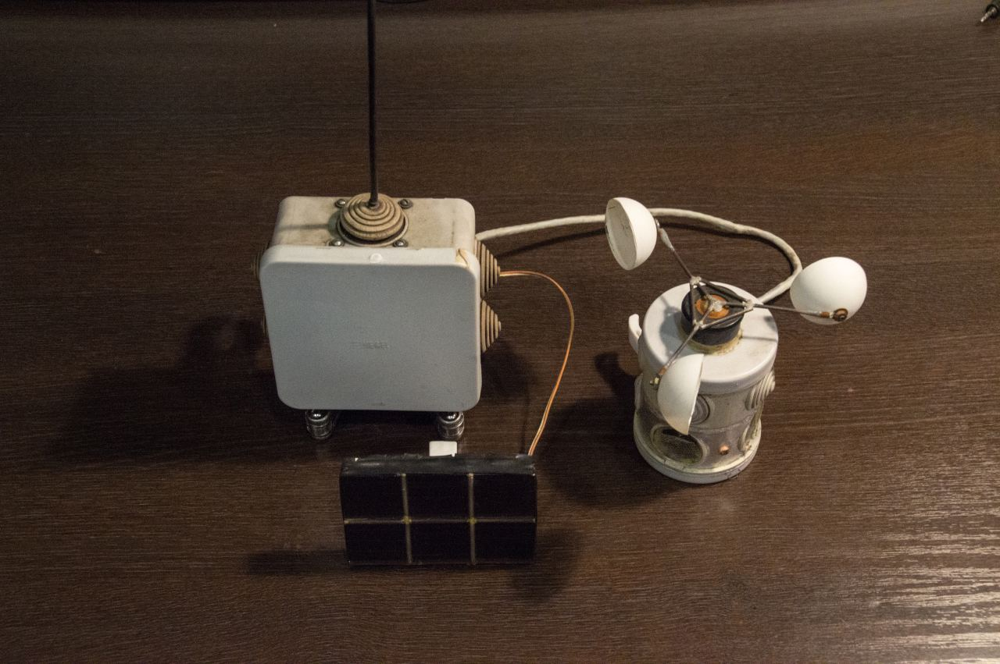
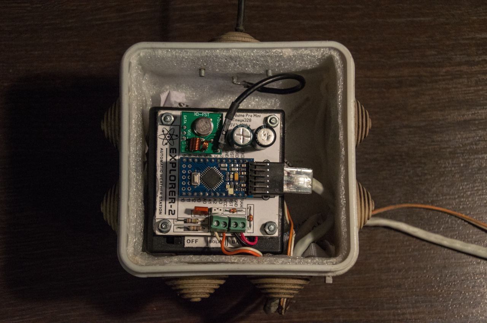
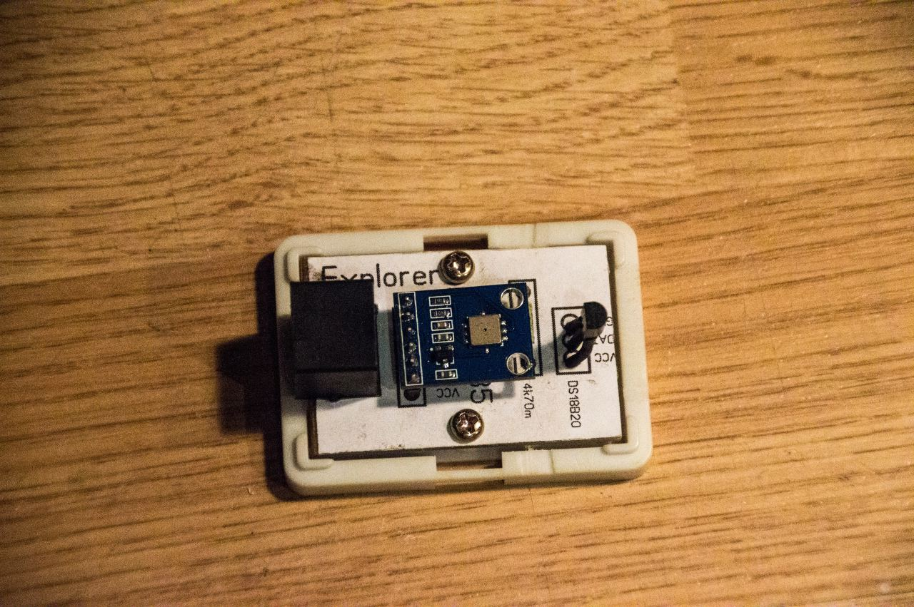
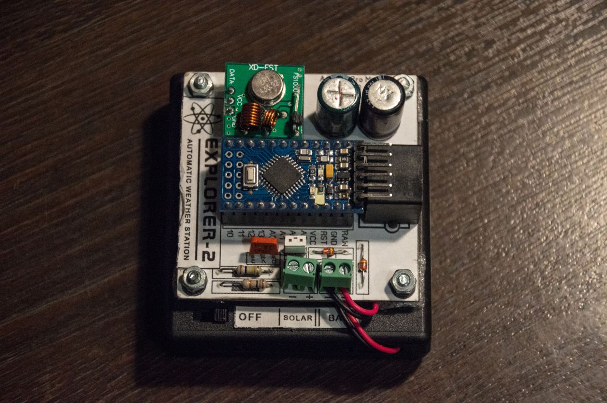

Arduino Weather Station
===============

### ⚠️ DEPRECATED ⚠️
See [DYI Arduino Weather Station](https://github.com/miksrv/arduino-weather-station) Repository

This project is designed to teach the basic skills and understanding of working with microcontrollers ATmega (Arduino). The project is a working model of an automated weather station, consisting of two the Component: transmitter and receiver. The controller transmits data to a remote web server, and to indicate the current readings uses character.



Project is an implementation of a Web-based interface for automatic weather station, made of improvised programs included with the Arduino. This program is intended only for training, it can not be used for weather forecasting and later use as an official source of information on meteorological reports. To use this web interface, you must have a web server such as Apache and PHP version with the support of not less than 5 and MySQL Data Base.

The weather station is capable of transmitting on the following environmental sotoyanii data protection:

- temperature
- humidity
- illumination
- wind speed
- atmosphere pressure

----------------------

### Arduino Components



- Arduino PRO mini
- Arduino NANO
- Arduino Ethernet Shield
- BMP085
- DHT22
- DS18B20
- RF modules



The project uses self-made developments, such as the airflow meter (angular velocity sensor based), voltmeter, light meter, as well as the switching board for Arduino PRO mini and transistor switches.

----------------------

### Arduino Libraries
List of additional (other than standard) libraries

##### Arduino Transmitter

- [DHT22 & DHT11] [DHT]
- [Virtual Wire] [VirtualWire]
- [Easy Transfer Virtual Wire] [EasyTransferVirtualWire]
- [Simple Timer] [SimpleTimer]
- [Low Power] [LowPower]



##### Arduino Master Controller

- [BMP085] [BMP085]
- [OneWire] [OneWire]
- [Dallas Temperature] [DallasTemperature]

[DHT]: <https://github.com/RobTillaart/Arduino/tree/master/libraries/DHTlib>
[VirtualWire]: <https://github.com/digistump/DigistumpArduino/tree/master/digistump-avr/libraries/VirtualWire>
[EasyTransferVirtualWire]: <https://github.com/madsci1016/Arduino-EasyTransfer>
[SimpleTimer]: <https://github.com/jfturcot/SimpleTimer>
[LowPower]: <https://github.com/rocketscream/Low-Power>
[BMP085]: <https://github.com/adafruit/Adafruit-BMP085-Library>
[OneWire]: <http://playground.arduino.cc/Learning/OneWire>
[DallasTemperature]: <https://github.com/milesburton/Arduino-Temperature-Control-Library>

----------------------

### Installation Web Portal

Create a new database, for example through phpMyAdmin and import the file to database.sql. In directory '/php.inc/config/' rename files 'sample.arduino.php' to 'arduino.php' and 'sample.mysql.php' to 'mysql.php'

Configuring the connection to the database, change the file '/php.inc/config/mysql.php':

```php
    $config['hostname'] = 'localhost';
    $config['username'] = 'root';
    $config['password'] = '';
    $config['database'] = 'meteo';
    $config['prefix']   = '';
```

The next step is to edit '/php.inc/config/arduino.php':

```php
    $config['latitude']   = '34.11';
    $config['longitude']  = '36.23';
    $config['gmt_offset'] = '1';
    $config['secret']     = '';
```

Enter the geographical coordinates of the location of the weather station and the time relative to the equator, to accurately calculate the time of sunrise and sunset of the Sun and the Moon.

Set the secret key, which must be identical key by Arduino sketch. This is to ensure that no one else could replace data. Keep your secret key.

When you install the program are not in the root directory of a site, you should change the .htaccess file, replacing the string:

```Apache
RewriteBase /
```
On this:
```Apache
RewriteBase /CATALOG_NAME/
```
And the option to edit the configuration file '*defines.php*':
```php
    define('DIR_ROOT', '/CATALOG_NAME/');
```

----------------------

### Usage

Your weather station on the Arduino to transmit a POST request to the address '/insert', containing a ready-made set of data. Example:

> POST http://example.com/insert
> ID=SECRET_KEY&temp1=25.6&temp2=21.6&battery=5.9&humd=44.2&press=775.0&light=260&wind=1.73

GET request contains the following parameters:
- "**temp1**" (*float*) the value of the first temperature sensor
- "**temp2**" (*float*) the value of the second temperature sensor
- "**humd**" (*float*) appointment hygrometer (humidity sensor)
- "**press**" (*float*) the value of the barometer (mm Hg)
- "**wind**" (*float*) appointment of an anemometer (wind speed sensor)
- "**light**" (*integer*) appointment luxmeter (light sensor)
- "**battery**" (*float*) voltage weather station batteries

The functionality of this project will be expanded.

----------------------

### Author
* WebSite: https://miksoft.pro

----------------------

### Components used

The following components and classes were used in the development of applications:

* [Weather Icons] [WeatherIcons] - Erik Flowers
* [Font Awesome] [FontAwesome] - created and maintained by Dave Gandy
* [Highcharts] [Highcharts] - Highsoft AS, Sentrumsgata, 6893 VIK I SOGN, Norway.
* [Moon phase calculation class] [MoonPhase] by Samir Shah
* Calculates the moon rise/set by [Keith Burnett] [KeithBurnett] and [Matt Hackmann] [MattHackmann]

  [WeatherIcons]: <http://erikflowers.github.io/weather-icons>
  [FontAwesome]: <https://github.com/FortAwesome/Font-Awesome>
  [MoonPhase]: <http://rayofsolaris.net>
  [KeithBurnett]: <http://bodmas.org>
  [MattHackmann]: <http://dxprog.com>
  [Highcharts]: <http://www.highcharts.com/>
